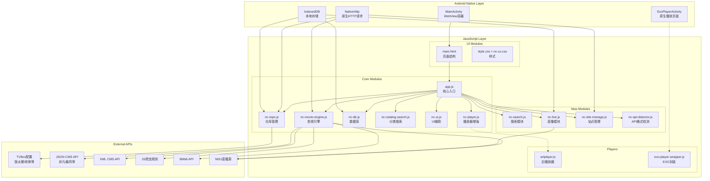
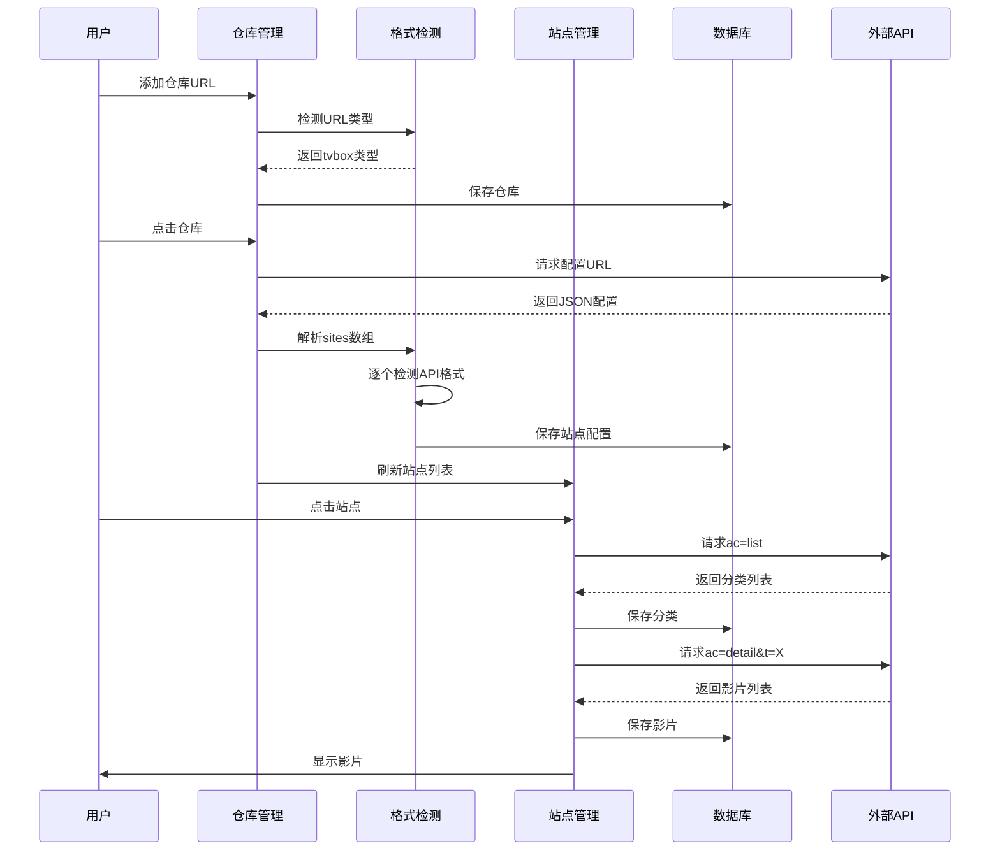

# 技术设计文档 - APP重构

Feature Name: 2026-07-06-app-refactor
Updated: 2026-07-06

## 描述

将个人助手Android WebView应用从彩票+影视混合应用重构为专注影视直播的TVBox客户端。核心改动包括：移除彩票功能、重构仓库/站点管理系统、新增多源搜索、替换播放器为EXO、新增直播频道功能。

## 架构



## 组件与接口

### 1. 仓库管理模块 (nc-repo.js 改造)

**职责**: 管理用户自定义的仓库分类和仓库地址

**数据结构**:
```javascript
// 仓库分类
{
  id: 1,                    // 自增ID
  name: '我的仓库',          // 分类名称
  createdAt: 1720000000000, // 创建时间
  updatedAt: 1720000000000  // 更新时间
}

// 仓库条目
{
  id: 1,
  categoryId: 1,            // 关联的分类ID
  name: '饭太硬',            // 仓库名称
  url: 'http://www.饭太硬.net/tv',  // 配置URL
  type: 'tvbox',            // 类型: tvbox | cms
  lastFetched: null,        // 最后获取时间
  sites: []                 // 缓存的站点列表
}
```

**关键接口**:
- `saveWarehouse(categoryId, name, url)` - 保存仓库
- `getWarehousesByCategory(categoryId)` - 按分类获取仓库
- `getAllCategories()` - 获取所有分类
- `deleteWarehouse(id)` - 删除仓库
- `fetchSiteConfig(url)` - 从仓库URL获取站点配置

**URL智能检测**:
```javascript
function detectUrlType(url) {
  // CMS接口特征: 包含 /api.php/provide/ 或 ffzyapi
  if (/api\.php\/provide|ffzyapi|cj\.ffzy/i.test(url)) {
    return 'cms';
  }
  // TVBox配置特征: 以 /.tv, /.json, /tv 结尾
  if (/\.tv$|\.json$|\/tv$|饭太硬|欧歌|肥猫/i.test(url)) {
    return 'tvbox';
  }
  // 默认尝试TVBox
  return 'unknown';
}
```

### 2. 站点管理模块 (nc-site-manage.js 新增)

**职责**: 管理从仓库获取的站点和用户本地添加的CMS接口

**数据结构**:
```javascript
// 站点
{
  id: 1,
  warehouseId: 1,           // 来源仓库ID，null表示本地站点
  name: '厂长影视',          // 站点名称
  key: 'czspp',             // 站点key
  api: 'https://www.czzy-api.com/api.php/provide/vod',  // API地址
  type: 'json',             // API类型: json | xml | js | bili
  timeout: 10,              // 超时时间(秒)
  searchable: 1,            // 是否支持搜索
  quickSearch: 1,           // 是否支持快速搜索
  categories: [],           // 缓存的分类列表
  ext: {},                  // 扩展参数
  createdAt: 1720000000000
}
```

**关键接口**:
- `fetchSitesFromWarehouse(warehouseId)` - 从仓库获取站点列表
- `addLocalSite(name, api, type)` - 添加本地CMS站点
- `getSitesByType(type)` - 按类型获取站点
- `deleteLocalSite(id)` - 删除本地站点
- `getSiteCategories(siteId)` - 获取站点分类
- `getSiteMovies(siteId, categoryId, page)` - 获取站点影片

### 3. API格式检测模块 (nc-api-detector.js 新增)

**职责**: 自动检测并适配不同站点的API格式

**检测逻辑**:
```javascript
async function detectApiFormat(site) {
  // 1. 检查api字段判断类型
  if (site.api.indexOf('.js') >= 0) return 'js';
  if (site.api.indexOf('bilibili') >= 0 || site.api.indexOf('bilivd') >= 0) return 'bili';
  
  // 2. 尝试请求ac=list获取分类
  try {
    const response = await fetch(site.api + '?ac=list');
    const data = await response.json();
    
    // 3. 检查响应格式
    if (data.class && data.list) return 'json';
    if (data.error) return 'json';
    
    // 4. 尝试获取详情
    const detailResponse = await fetch(site.api + '?ac=detail&t=1');
    const detailData = await detailResponse.json();
    if (detailData.list && detailData.list[0].vod_id) return 'json';
  } catch (e) {
    // 5. 尝试XML格式
    try {
      const response = await fetch(site.api + '?ac=detail');
      const text = await response.text();
      if (text.indexOf('<video>') >= 0) return 'xml';
    } catch (e2) {}
  }
  
  return 'json'; // 默认假设JSON
}
```

**数据标准化**:
```javascript
function normalizeSiteData(data, format, category) {
  if (format === 'json') {
    return (data.list || []).map(v => ({
      id: String(v.vod_id || v.id),
      title: v.vod_name || v.name,
      pic: v.vod_pic || v.pic,
      type: v.type_name || category,
      year: v.vod_year || '',
      tag: v.vod_remarks || v.note,
      play: v.vod_play_url || '',
      desc: v.vod_content || v.desc,
      raw: v
    }));
  }
  
  if (format === 'xml') {
    const videos = data.getElementsByTagName('video');
    return Array.from(videos).map(v => ({
      id: textOf(v, 'id'),
      title: textOf(v, 'name'),
      pic: textOf(v, 'pic'),
      type: textOf(v, 'type'),
      tag: textOf(v, 'note'),
      play: v.getElementsByTagName('dd')[0]?.textContent || '',
      raw: v
    }));
  }
  
  return [];
}
```

### 4. 搜索模块 (nc-search.js 新增)

**职责**: 多源搜索功能

**数据结构**:
```javascript
var searchState = {
  keyword: '',
  exactMatch: false,      // 精确匹配
  listView: false,        // 列表视图
  selectedSources: [],    // 选中的源ID列表
  allSources: [],         // 所有可用源
  results: {},            // 按源分组的搜索结果
  isLoading: false
};
```

**关键接口**:
- `initSearch(sources)` - 初始化搜索，加载可用源列表
- `toggleExactMatch()` - 切换精确/模糊匹配
- `toggleListView()` - 切换列表/网格视图
- `selectAllSources()` - 全选源
- `selectNoneSources()` - 全不选源
- `toggleSource(id)` - 切换单个源的选中状态
- `executeSearch()` - 执行搜索
- `searchBySource(sourceId, keyword, exact)` - 按单个源搜索
- `switchSourceResult(sourceId)` - 切换显示的源结果

**搜索请求**:
```javascript
async function searchBySource(sourceId, keyword, exact) {
  const site = await getSiteById(sourceId);
  const params = exact ? 
    `ac.detail&wd=${encodeURIComponent(keyword)}` :
    `ac=detail&wd=${encodeURIComponent(keyword)}`;
  
  try {
    const response = await fetch(site.api + '?' + params);
    const data = await response.json();
    return {
      sourceId: sourceId,
      sourceName: site.name,
      movies: normalizeSiteData(data, site.type, '搜索')
    };
  } catch (e) {
    return { sourceId, sourceName: site.name, movies: [], error: e.message };
  }
}
```

### 5. 直播模块 (nc-live.js 新增)

**职责**: 直播频道管理和播放

**数据结构**:
```javascript
// 直播频道
{
  id: 'live_1',
  name: 'CCTV1',
  url: 'http://live.example.com/cctv1.m3u8',
  group: '央视',
  logo: '',
  fromSite: 'warehouse_1'
}
```

**关键接口**:
- `fetchLiveFromWarehouse(warehouseId)` - 从仓库获取直播源
- `parseM3U(text)` - 解析M3U格式直播源
- `parseTXT(text)` - 解析TXT格式直播源
- `getChannelsByGroup()` - 按分组获取频道
- `playChannel(channelId)` - 播放频道

**M3U解析**:
```javascript
function parseM3U(text) {
  const channels = [];
  const lines = text.split(/\r?\n/);
  let currentChannel = null;
  
  for (let i = 0; i < lines.length; i++) {
    const line = lines[i].trim();
    
    if (line.startsWith('#EXTINF:')) {
      currentChannel = {
        name: line.split(',')?.[1] || '未知频道',
        group: extractGroup(line),
        logo: extractLogo(line),
        url: ''
      };
    } else if (line.startsWith('http') || line.startsWith('rtmp')) {
      if (currentChannel) {
        currentChannel.url = line;
        channels.push(currentChannel);
        currentChannel = null;
      }
    }
  }
  
  return channels;
}

function extractGroup(line) {
  const match = line.match(/group-title="([^"]*)"/);
  return match ? match[1] : '其他';
}

function extractLogo(line) {
  const match = line.match(/tvg-logo="([^"]*)"/);
  return match ? match[1] : '';
}
```

### 6. ExoPlayer封装 (exo-player-wrapper.js 新增)

**职责**: 在WebView中封装EXO播放器调用

**Android原生接口**:
```java
// ExoPlayerWrapper.java
public class ExoPlayerWrapper {
    private ExoPlayer exoPlayer;
    private WebView webView;
    
    @JavascriptInterface
    public void play(String url, String title) {
        // 创建或复用ExoPlayer实例
        if (exoPlayer == null) {
            exoPlayer = new ExoPlayer.Builder(context).build();
        }
        
        MediaItem item = MediaItem.fromUri(url);
        exoPlayer.setMediaItem(item);
        exoPlayer.prepare();
        exoPlayer.play();
        
        // 通知WebView播放开始
        webView.evaluateJavascript(
            "onPlayStarted('" + title + "')", null);
    }
    
    @JavascriptInterface
    public void pause() {
        if (exoPlayer != null) exoPlayer.pause();
    }
    
    @JavascriptInterface
    public void seekTo(int position) {
        if (exoPlayer != null) exoPlayer.seekTo(position);
    }
    
    @JavascriptInterface
    public void release() {
        if (exoPlayer != null) {
            exoPlayer.release();
            exoPlayer = null;
        }
    }
}
```

**JavaScript封装**:
```javascript
window.ExoPlayerWrapper = {
  play: function(url, title) {
    // 调用原生EXO播放器
    if (window.NativeExoPlayer) {
      window.NativeExoPlayer.play(url, title);
    } else {
      // 降级到WebView内播放
      fallbackPlay(url, title);
    }
  },
  
  pause: function() {
    if (window.NativeExoPlayer) {
      window.NativeExoPlayer.pause();
    }
  },
  
  seekTo: function(position) {
    if (window.NativeExoPlayer) {
      window.NativeExoPlayer.seekTo(position);
    }
  },
  
  release: function() {
    if (window.NativeExoPlayer) {
      window.NativeExoPlayer.release();
    }
  }
};
```

### 7. 数据库模块改造 (nc-db.js)

**新增对象存储**:

```javascript
// warehouses: 仓库存储
// keyPath: id (autoIncrement)
// indexes: categoryId, url

// sites: 站点存储
// keyPath: id (autoIncrement)
// indexes: warehouseId, api, type

// liveChannels: 直播频道存储
// keyPath: id (autoIncrement)
// indexes: fromSite, group
```

**修改后的IndexedDB Schema**:
```javascript
req.onupgradeneeded = function(e) {
  var d = e.target.result;
  
  // 现有stores: sources, categories, movies (保持不变)
  
  // 新增: warehouses
  if (!d.objectStoreNames.contains('warehouses')) {
    var wStore = d.createObjectStore('warehouses', { keyPath: 'id', autoIncrement: true });
    wStore.createIndex('categoryId', 'categoryId', { unique: false });
    wStore.createIndex('url', 'url', { unique: false });
  }
  
  // 新增: siteConfigs
  if (!d.objectStoreNames.contains('siteConfigs')) {
    var sStore = d.createObjectStore('siteConfigs', { keyPath: 'id', autoIncrement: true });
    sStore.createIndex('warehouseId', 'warehouseId', { unique: false });
    sStore.createIndex('api', 'api', { unique: false });
    sStore.createIndex('type', 'type', { unique: false });
  }
  
  // 新增: liveChannels
  if (!d.objectStoreNames.contains('liveChannels')) {
    var lStore = d.createObjectStore('liveChannels', { keyPath: 'id', autoIncrement: true });
    lStore.createIndex('fromSite', 'fromSite', { unique: false });
    lStore.createIndex('group', 'group', { unique: false });
  }
};
```

## 数据模型

### 仓库-站点-分类-影片 数据流



### TVBox配置JSON结构

```json
{
  "spider": "图片URL",
  "wallpaper": "壁纸URL",
  "sites": [
    {
      "key": "czspp",
      "name": "厂长影视",
      "type": 1,
      "api": "https://czzy-api.com/api.php/provide/vod",
      "searchable": 1,
      "quickSearch": 1,
      "timeout": 10
    }
  ],
  "lives": [
    {
      "name": "直播",
      "type": 0,
      "url": "http://example.com/live.m3u"
    }
  ],
  "rules": [...],
  "ads": [...]
}
```

### CMS API响应结构 (JSON)

```json
{
  "code": 1,
  "msg": "success",
  "page": "1",
  "pagecount": "10",
  "limit": "20",
  "total": "200",
  "list": [
    {
      "vod_id": "123",
      "vod_name": "电影名称",
      "type_id": "1",
      "type_name": "电影",
      "vod_pic": "https://example.com/poster.jpg",
      "vod_year": "2024",
      "vod_remarks": "HD",
      "vod_content": "简介...",
      "vod_play_url": "第1集$http://...#第2集$http://...",
      "vod_play_from": "线路1$$$线路2"
    }
  ],
  "class": [
    {
      "type_id": "1",
      "type_name": "电影",
      "type_pid": "0"
    }
  ]
}
```

## 正确性属性

### 不变量

1. **仓库URL有效性**: 仓库URL必须是有效的HTTP/HTTPS地址
2. **站点唯一性**: 同一仓库下的站点API地址必须唯一
3. **分类完整性**: 每个站点至少有一个分类（推荐）
4. **数据一致性**: 影片记录必须关联到有效的站点和分类

### 约束

1. **仓库地址格式**: 必须以http://或https://开头
2. **CMS接口格式**: 必须包含/api.php/provide或类似端点
3. **直播源格式**: 必须是M3U或TXT格式
4. **搜索源选择**: 至少选择一个源才能执行搜索

## 错误处理

### 仓库配置获取失败

```javascript
async function fetchWarehouseConfig(url) {
  try {
    const response = await fetch(url);
    if (!response.ok) throw new Error(`HTTP ${response.status}`);
    const data = await response.json();
    return data;
  } catch (e) {
    // 尝试备用URL
    const backupUrls = getBackupUrls(url);
    for (const backupUrl of backupUrls) {
      try {
        const data = await fetch(backupUrl);
        if (data) return data;
      } catch (e2) {}
    }
    alert('仓库配置加载失败，请检查网络或地址');
    return null;
  }
}
```

### API请求超时

```javascript
function fetchWithTimeout(url, timeout = 10000) {
  return Promise.race([
    fetch(url),
    new Promise((_, reject) => 
      setTimeout(() => reject(new Error('请求超时')), timeout)
    )
  ]);
}
```

### 数据解析失败

```javascript
function safeParseJSON(text) {
  try {
    return JSON.parse(text);
  } catch (e) {
    console.error('JSON解析失败:', e);
    return null;
  }
}
```

## 测试策略

### 单元测试

1. **URL类型检测测试**:
   - 输入饭太硬URL，返回tvbox
   - 输入非凡采集URL，返回cms
   - 输入无效URL，返回unknown

2. **API格式检测测试**:
   - JSON API正确解析
   - XML API正确解析
   - 错误响应正确处理

3. **直播源解析测试**:
   - M3U格式正确解析
   - TXT格式正确解析
   - 空格式正确处理

### 集成测试

1. **仓库-站点-影片流程测试**:
   - 添加仓库 -> 获取站点 -> 获取分类 -> 获取影片
   - 验证数据正确存储到IndexedDB
   - 验证UI正确显示

2. **多源搜索测试**:
   - 选择多个源执行搜索
   - 验证各源结果正确合并
   - 验证源切换功能正常

3. **播放器测试**:
   - EXO播放器正确播放MP4
   - EXO播放器正确播放M3U8
   - 播放进度正确保存和恢复

### 用户验收测试

1. 长按主页显示仓库管理弹窗
2. 添加仓库并成功获取站点
3. 点击站点显示分类和影片
4. 执行搜索并查看结果
5. 播放影片和直播频道

## 参考

[^1]: [/workspace/.monkeycode/docs/饭太硬TV数据抓取方案.md](.monkeycode/docs/饭太硬TV数据抓取方案.md) - 饭太硬数据获取方案
[^2]: [/workspace/.monkeycode/docs/饭太硬TV站点深度分析.md](.monkeycode/docs/饭太硬TV站点深度分析.md) - 站点结构和API分析
[^3]: [/workspace/app_new/assets/js/nc-db.js](app_new/assets/js/nc-db.js) - 现有数据库模块
[^4]: [/workspace/app_new/assets/js/nc-repo.js](app_new/assets/js/nc-repo.js) - 现有仓库管理模块
[^5]: [/workspace/app_new/assets/js/nc-movie-engine.js](app_new/assets/js/nc-movie-engine.js) - 现有影视引擎模块
