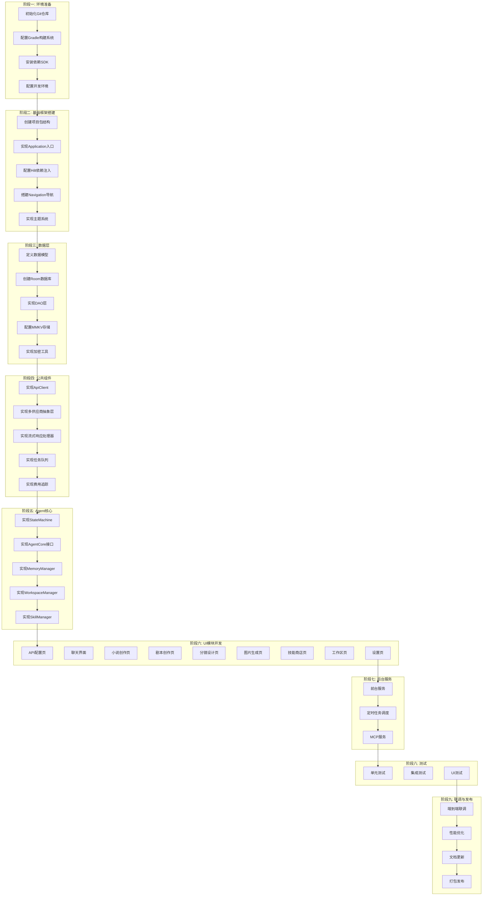

# Agent工作助手 - 开发工作流与任务清单

**文档版本**: 1.0
**生成日期**: 2026-08-03
**项目状态**: 需求与设计已完成，待开发启动

---

## 一、开发工作流总览

### 1.1 整体流程架构图



### 1.2 开发阶段时间估算

| 阶段 | 预估时间 | 并行任务数 | 关键路径 |
|------|----------|------------|----------|
| 环境准备 | 0.5 天 | 1 | A1→A2→A3→A4 |
| 基础框架 | 1 天 | 3 | B1→B2→B3→B4→B5 |
| 数据层 | 1.5 天 | 4 | C1→C2→C3→C4→C5 |
| 公共组件 | 2 天 | 3 | D1→D2→D3→D4→D5 |
| Agent核心 | 2 天 | 3 | E1→E2→E3→E4→E5 |
| UI模块 | 5 天 | 6 | F1~F9 并行开发 |
| 后台服务 | 1.5 天 | 2 | G1→G2→G3 |
| 测试 | 2 天 | 3 | H1→H2→H3 |
| 联调发布 | 1 天 | 1 | I1→I2→I3→I4 |
| **总计** | **17 天** | - | - |

---

## 二、详细任务清单

### 阶段一：环境准备 (预计 0.5 天)

| 任务编号 | 任务名称 | 开发目标 | 交付物 | 验收标准 | 依赖 |
|----------|----------|----------|--------|----------|------|
| E01 | 初始化Git仓库 | 创建项目版本控制 | `.gitignore`, `README.md` | Git仓库初始化成功，可提交 | - |
| E02 | 配置Gradle构建系统 | 设置AGP、Kotlin版本、构建脚本 | `build.gradle.kts`, `settings.gradle.kts` | 构建成功，无报错 | E01 |
| E03 | 安装Android SDK | 安装所需SDK组件 | SDK Manager截图 | minSdk 29, targetSdk 34, compileSdk 36 | E02 |
| E04 | 配置开发环境 | 安装Android Studio、JDK 11+ | 环境配置文档 | Android Studio可打开项目，Gradle Sync成功 | E02, E03 |

**并行组**: E02 和 E03 可并行执行

---

### 阶段二：基础框架搭建 (预计 1 天)

| 任务编号 | 任务名称 | 开发目标 | 交付物 | 验收标准 | 依赖 |
|----------|----------|----------|--------|----------|------|
| F01 | 创建项目包结构 | 建立标准MVVM目录结构 | 完整目录树 | 目录符合设计规范 | E04 |
| F02 | 实现Application入口 | 创建AgentApp.kt，初始化MMKV、数据库 | `AgentApp.kt` | 应用启动无崩溃 | F01 |
| F03 | 配置Hilt依赖注入 | 创建AppModule，配置单例、作用域 | `di/AppModule.kt` | Hilt注入测试通过 | F01 |
| F04 | 搭建Navigation导航 | 实现AppNavigation.kt，配置路由 | `navigation/AppNavigation.kt` | 页面跳转正常 | F01 |
| F05 | 实现主题系统 | 创建Color、Theme、Type配置文件 | `theme/` 目录 | 支持深色/浅色模式切换 | F01 |
| F06 | 创建MainActivity | 实现主界面Activity，集成Compose | `MainActivity.kt` | 应用可正常启动并显示主页 | F04, F05 |

**并行组**: F02、F03、F05 可并行执行（基于F01）

---

### 阶段三：数据层 (预计 1.5 天)

| 任务编号 | 任务名称 | 开发目标 | 交付物 | 验收标准 | 依赖 |
|----------|----------|----------|--------|----------|------|
| D01 | 定义数据模型 | 创建所有Room实体类 | `data/entity/` 目录（10个实体） | 所有实体类编译通过 | F01 |
| D02 | 创建Room数据库 | 实现AppDatabase、Migration | `data/database/AppDatabase.kt` | 数据库创建成功，版本迁移正常 | D01 |
| D03 | 实现DAO层 | 创建所有DAO接口及查询方法 | `data/dao/` 目录（8个DAO） | 所有CRUD操作测试通过 | D02 |
| D04 | 配置MMKV存储 | 初始化MMKV，实现加密存储 | `utils/MMKVUtil.kt` | 加密/解密测试通过 | D01 |
| D05 | 实现加密工具 | 封装AES加密，保护API Key | `utils/EncryptionUtil.kt` | 加密结果可逆，密钥安全 | D04 |
| D06 | 编写数据层单元测试 | 测试DAO、加密工具 | `test/` 目录 | 测试覆盖率 > 80% | D02, D05 |

**并行组**: D01、D03、D05 可并行执行（D02依赖D01，D06依赖D02和D05）

---

### 阶段四：公共组件 (预计 2 天)

| 任务编号 | 任务名称 | 开发目标 | 交付物 | 验收标准 | 依赖 |
|----------|----------|----------|--------|----------|------|
| C01 | 实现OkHttp客户端 | 配置OkHttpClient，设置超时、拦截器 | `network/OkHttpUtil.kt` | HTTP请求正常，日志拦截器工作 | F01 |
| C02 | 实现Retrofit API接口 | 定义文本生成和图像生成API接口 | `network/ApiService.kt` | API接口定义完整，无编译错误 | C01 |
| C03 | 实现多供应商抽象层 | 定义TextBackend、ImageBackend接口 | `model/TextBackend.kt`, `model/ImageBackend.kt` | 接口定义符合设计规范 | C02 |
| C04 | 实现DeepSeek后端 | 实现DeepSeekTextBackend类 | `network/deepseek/DeepSeekTextBackend.kt` | 流式响应解析正确 | C03 |
| C05 | 实现OpenAI后端 | 实现OpenAITextBackend类 | `network/openai/OpenAITextBackend.kt` | 兼容OpenAI API格式 | C03 |
| C06 | 实现Gemini后端 | 实现GeminiTextBackend和GeminiImageBackend | `network/gemini/GeminiTextBackend.kt` | 支持文本和图像生成 | C03 |
| C07 | 实现流式响应处理器 | 实现StreamResponseHandler | `utils/StreamResponseHandler.kt` | 流式数据实时推送UI | C04~C06 |
| C08 | 实现任务队列 | 实现TaskQueue，支持RPM限速 | `agent/TaskQueue.kt` | 限流逻辑正确，任务有序执行 | C07 |
| C09 | 实现费用追踪 | 实现CostTracker，记录Token用量 | `agent/CostTracker.kt` | 费用计算准确 | C08 |
| C10 | 编写组件单元测试 | 测试网络层、任务队列 | `test/` 目录 | 测试覆盖率 > 70% | C04~C09 |

**并行组**: C03、C07 可并行；C04、C05、C06 可并行（均依赖C03）；C08、C09 可并行（依赖C07）

---

### 阶段五：Agent核心 (预计 2 天)

| 任务编号 | 任务名称 | 开发目标 | 交付物 | 验收标准 | 依赖 |
|----------|----------|----------|--------|----------|------|
| A01 | 实现AgentStateMachine | 实现任务状态机，定义状态转换 | `agent/StateMachine.kt` | 状态转换逻辑正确，无死锁 | C08 |
| A02 | 实现AgentCore接口 | 定义任务创建、执行、回调接口 | `agent/AgentCore.kt` | 接口设计完整 | A01 |
| A03 | 实现MemoryManager | 实现三层记忆系统（SOUL/CHAT/MEMORY） | `agent/MemoryManager.kt` | 记忆文件读写正常 | A02 |
| A04 | 实现WorkspaceManager | 实现工作区文件系统操作 | `agent/WorkspaceManager.kt` | 文件操作正确，支持预览 | A02 |
| A05 | 实现SkillManager | 实现技能安装、启用、禁用 | `agent/SkillManager.kt` | 技能加载正常 | A02 |
| A06 | 实现CharacterConsistencyManager | 实现角色一致性管理 | `agent/CharacterConsistencyManager.kt` | 角色资产关联正确 | A04 |
| A07 | 实现VersionHistoryManager | 实现版本历史管理 | `agent/VersionHistoryManager.kt` | 版本回滚正常 | A04 |
| A08 | 实现TaskScheduler | 实现定时任务调度 | `agent/TaskScheduler.kt` | 定时任务准确执行 | A01 |
| A09 | 编写Agent单元测试 | 测试状态机、记忆、工作区 | `test/` 目录 | 测试覆盖率 > 75% | A01~A08 |

**并行组**: A03、A04、A05 可并行（依赖A02）；A06、A07、A08 可并行（依赖A04）

---

### 阶段六：UI模块开发 (预计 5 天)

#### 6.1 基础组件 (预计 0.5 天)

| 任务编号 | 任务名称 | 开发目标 | 交付物 | 验收标准 | 依赖 |
|----------|----------|----------|--------|----------|------|
| U01 | 实现通用组件 | LoadingSpinner、ErrorView、EmptyView | `ui/components/` 目录 | 组件可复用，样式统一 | F05 |
| U02 | 实现TopAppBar | 应用顶部导航栏 | `ui/components/TopAppBar.kt` | 支持标题、导航、菜单 | F05 |

#### 6.2 设置模块 (预计 0.5 天)

| 任务编号 | 任务名称 | 开发目标 | 交付物 | 验收标准 | 依赖 |
|----------|----------|----------|--------|----------|------|
| U03 | 实现API配置页 | 配置模型供应商API | `ui/screens/settings/ApiConfigPanel.kt` | API验证流程完整 | U01, C01 |
| U04 | 实现模型配置页 | 配置场景模型绑定 | `ui/screens/settings/ModelConfigPanel.kt` | 模型选择正常 | U03 |
| U05 | 实现记忆配置页 | 编辑SOUL/CHAT/MEMORY文件 | `ui/screens/settings/MemoryConfigPanel.kt` | 文件编辑保存正常 | U03, A03 |
| U06 | 实现SettingsViewModel | 管理设置状态 | `viewmodel/SettingsViewModel.kt` | 状态管理正确 | U03~U05 |

#### 6.3 聊天模块 (预计 1 天)

| 任务编号 | 任务名称 | 开发目标 | 交付物 | 验收标准 | 依赖 |
|----------|----------|----------|--------|----------|------|
| U07 | 实现ChatMessageItem | 单条消息组件 | `ui/screens/chat/components/ChatMessageItem.kt` | 消息渲染正确 | U01 |
| U08 | 实现ChatMessageList | 消息列表，支持自动滚动 | `ui/screens/chat/components/ChatMessageList.kt` | 列表流畅，自动滚动 | U07 |
| U09 | 实现ChatInputBar | 输入框组件 | `ui/screens/chat/components/ChatInputBar.kt` | 输入正常，发送正常 | U01 |
| U10 | 实现ChatScreen | 聊天主界面 | `ui/screens/chat/ChatScreen.kt` | 聊天流程完整 | U07~U09 |
| U11 | 实现ChatViewModel | 管理聊天状态 | `viewmodel/ChatViewModel.kt` | 多会话隔离，流式响应 | U10, C07 |

#### 6.4 小说模块 (预计 0.5 天)

| 任务编号 | 任务名称 | 开发目标 | 交付物 | 验收标准 | 依赖 |
|----------|----------|----------|--------|----------|------|
| U12 | 实现NovelEditor | 小说编辑器 | `ui/screens/novel/components/NovelEditor.kt` | 编辑正常，自动保存 | U01 |
| U13 | 实现NovelScreen | 小说创作主界面 | `ui/screens/novel/NovelScreen.kt` | 章节管理完整 | U12 |
| U14 | 实现NovelViewModel | 管理小说状态 | `viewmodel/NovelViewModel.kt` | 自动保存逻辑正确 | U13 |

#### 6.5 剧本模块 (预计 0.5 天)

| 任务编号 | 任务名称 | 开发目标 | 交付物 | 验收标准 | 依赖 |
|----------|----------|----------|--------|----------|------|
| U15 | 实现ScriptEditor | 剧本编辑器 | `ui/screens/script/components/ScriptEditor.kt` | 剧本格式正确 | U01 |
| U16 | 实现ScriptScreen | 剧本创作主界面 | `ui/screens/script/ScriptScreen.kt` | 场景管理完整 | U15 |
| U17 | 实现ScriptViewModel | 管理剧本状态 | `viewmodel/ScriptViewModel.kt` | 格式转换正常 | U16 |

#### 6.6 分镜模块 (预计 0.5 天)

| 任务编号 | 任务名称 | 开发目标 | 交付物 | 验收标准 | 依赖 |
|----------|----------|----------|--------|----------|------|
| U18 | 实现StoryboardCard | 分镜卡片组件 | `ui/screens/storyboard/components/StoryboardCard.kt` | 卡片渲染正确 | U01 |
| U19 | 实现StoryboardScreen | 分镜设计主界面 | `ui/screens/storyboard/StoryboardScreen.kt` | 镜头管理完整 | U18 |
| U20 | 实现StoryboardViewModel | 管理分镜状态 | `viewmodel/StoryboardViewModel.kt` | 角色关联正常 | U19 |

#### 6.7 图片生成模块 (预计 0.5 天)

| 任务编号 | 任务名称 | 开发目标 | 交付物 | 验收标准 | 依赖 |
|----------|----------|----------|--------|----------|------|
| U21 | 实现ImageGallery | 图片画廊组件 | `ui/screens/imagegen/components/ImageGallery.kt` | 图片加载流畅 | U01 |
| U22 | 实现ImageGenScreen | 图片生成主界面 | `ui/screens/imagegen/ImageGenScreen.kt` | 生成流程完整 | U21 |
| U23 | 实现ImageGenViewModel | 管理图片生成状态 | `viewmodel/ImageGenViewModel.kt` | 任务队列集成正确 | U22, C08 |

#### 6.8 技能模块 (预计 0.5 天)

| 任务编号 | 任务名称 | 开发目标 | 交付物 | 验收标准 | 依赖 |
|----------|----------|----------|--------|----------|------|
| U24 | 实现SkillCard | 技能卡片组件 | `ui/screens/skills/components/SkillCard.kt` | 卡片渲染正确 | U01 |
| U25 | 实现SkillStoreScreen | 技能商店界面 | `ui/screens/skills/SkillStoreScreen.kt` | 安装/启用/禁用流程完整 | U24 |
| U26 | 实现SkillViewModel | 管理技能状态 | `viewmodel/SkillViewModel.kt` | 技能状态同步正确 | U25, A05 |

#### 6.9 工作区模块 (预计 0.5 天)

| 任务编号 | 任务名称 | 开发目标 | 交付物 | 验收标准 | 依赖 |
|----------|----------|----------|--------|----------|------|
| U27 | 实现FileBrowser | 文件浏览器组件 | `ui/screens/workspace/components/FileBrowser.kt` | 文件列表正常 | U01 |
| U28 | 实现TerminalView | 终端视图组件 | `ui/screens/workspace/components/TerminalView.kt` | 命令执行正常 | U01 |
| U29 | 实现WorkspaceScreen | 工作区主界面 | `ui/screens/workspace/WorkspaceScreen.kt` | 文件操作完整 | U27, U28 |
| U30 | 实现ProjectViewModel | 管理项目状态 | `viewmodel/ProjectViewModel.kt` | 项目切换正常 | U29 |

#### 6.10 项目列表与主页 (预计 0.5 天)

| 任务编号 | 任务名称 | 开发目标 | 交付物 | 验收标准 | 依赖 |
|----------|----------|----------|--------|----------|------|
| U31 | 实现ProjectCard | 项目卡片组件 | `ui/screens/projects/components/ProjectCard.kt` | 卡片渲染正确 | U01 |
| U32 | 实现ProjectsScreen | 项目列表界面 | `ui/screens/projects/ProjectsScreen.kt` | 项目CRUD完整 | U31 |
| U33 | 实现MainScreen | 主界面（BottomNavigation） | `ui/screens/main/MainScreen.kt` | 导航正常 | U32 |

---

### 阶段七：后台服务 (预计 1.5 天)

| 任务编号 | 任务名称 | 开发目标 | 交付物 | 验收标准 | 依赖 |
|----------|----------|----------|--------|----------|------|
| S01 | 实现AgentForegroundService | 前台服务，保持Agent运行 | `service/AgentForegroundService.kt` | 服务启动正常，通知显示正确 | A01 |
| S02 | 实现TaskSchedulerService | 定时任务服务 | `service/TaskSchedulerService.kt` | 闹钟触发准确 | S01, A08 |
| S03 | 实现McpServerService | MCP局域网服务 | `service/McpServerService.kt` | API端点可访问 | S01 |
| S04 | 配置AndroidManifest | 注册服务、权限 | `AndroidManifest.xml` | 权限配置完整 | S01~S03 |

**并行组**: S01、S04 可并行；S02、S03 可并行（依赖S01）

---

### 阶段八：测试 (预计 2 天)

| 任务编号 | 任务名称 | 开发目标 | 交付物 | 验收标准 | 依赖 |
|----------|----------|----------|--------|----------|------|
| T01 | 编写ViewModel单元测试 | 测试所有ViewModel | `test/` 目录 | 覆盖率 > 60% | U03~U33 |
| T02 | 编写Repository单元测试 | 测试所有Repository | `test/` 目录 | 覆盖率 > 70% | D03, C02 |
| T03 | 编写Agent单元测试 | 测试状态机、记忆、工作区 | `test/` 目录 | 覆盖率 > 75% | A01~A08 |
| T04 | 编写Compose UI测试 | 测试关键界面交互 | `androidTest/` 目录 | 关键流程测试通过 | U03~U33 |
| T05 | 编写集成测试 | 测试数据库+网络整合 | `androidTest/` 目录 | 核心流程测试通过 | T01~T04 |
| T06 | 性能测试 | 测试内存、启动时间 | 性能测试报告 | 内存 < 200MB，启动 < 3秒 | T05 |

**并行组**: T01、T02、T03 可并行；T04、T05、T06 可并行（依赖前面测试）

---

### 阶段九：联调与发布 (预计 1 天)

| 任务编号 | 任务名称 | 开发目标 | 交付物 | 验收标准 | 依赖 |
|----------|----------|----------|--------|----------|------|
| I01 | 端到端联调 | 验证完整业务流程 | 联调报告 | 所有P0需求验收标准通过 | T01~T06 |
| I02 | 性能优化 | 优化启动时间、内存占用 | 优化报告 | 满足NFR性能指标 | I01 |
| I03 | 文档更新 | 更新README、API文档 | `README.md`, `docs/` | 文档完整准确 | I01 |
| I04 | 打包Debug APK | 生成调试包 | `app/build/outputs/apk/debug/` | APK可安装运行 | I02 |
| I05 | 打包Release APK | 生成发布包 | `app/build/outputs/apk/release/` | 签名正确，混淆正常 | I02 |
| I06 | 提交代码 | 推送到Git仓库 | Git提交记录 | 提交信息规范 | I04, I05 |

---

## 三、任务依赖关系图

```mermaid
graph LR
    subgraph "环境准备"
        E01 --> E02 --> E03
        E02 --> E04
        E03 --> E04
    end
    
    subgraph "基础框架"
        E04 --> F01 --> F02
        E04 --> F03
        E04 --> F05
        F01 --> F04
        F04 & F05 --> F06
    end
    
    subgraph "数据层"
        F01 --> D01 --> D02 --> D03
        D01 --> D04 --> D05
        D02 & D05 --> D06
    end
    
    subgraph "公共组件"
        F01 --> C01 --> C02 --> C03
        C03 --> C04 & C05 & C06
        C03 --> C07 --> C08 --> C09
        C04 & C05 & C06 & C07 & C08 & C09 --> C10
    end
    
    subgraph "Agent核心"
        C08 --> A01 --> A02
        A02 --> A03 & A04 & A05
        A04 --> A06 & A07 & A08
        A01 & A02 & A03 & A04 & A05 & A06 & A07 & A08 --> A09
    end
    
    subgraph "UI模块"
        F05 --> U01 & U02
        U01 & C01 --> U03 --> U04 --> U05
        U05 --> A03
        U01 --> U07 --> U08 --> U09 --> U10 --> U11
        U01 --> U12 --> U13 --> U14
        U01 --> U15 --> U16 --> U17
        U01 --> U18 --> U19 --> U20
        U01 & C08 --> U21 --> U22 --> U23
        U01 --> U24 --> U25 --> U26
        U01 --> U27 & U28 --> U29 --> U30
        U01 --> U31 --> U32 --> U33
    end
    
    subgraph "后台服务"
        A01 --> S01 --> S02
        S01 --> S03
        S01 --> S04
    end
    
    subgraph "测试"
        U03~U33 --> T01
        D03 & C02 --> T02
        A01~A08 --> T03
        U03~U33 --> T04
        T01 & T02 & T03 & T04 --> T05
        T05 --> T06
    end
    
    subgraph "联调发布"
        T01~T06 --> I01 --> I02
        I01 --> I03
        I02 --> I04 & I05
        I04 & I05 --> I06
    end
```

---

## 四、并行开发策略

### 4.1 可并行任务组

| 并行组 | 任务编号 | 说明 |
|--------|----------|------|
| P1 | E02, E03 | Gradle配置与SDK安装独立 |
| P2 | F02, F03, F05 | Application、Hilt、Theme配置独立 |
| P3 | D01, D03, D05 | 数据模型、DAO、加密工具独立定义 |
| P4 | C04, C05, C06 | 三个供应商后端实现独立 |
| P5 | C08, C09 | 任务队列与费用追踪独立实现 |
| P6 | A03, A04, A05 | 记忆、工作区、技能管理器独立 |
| P7 | A06, A07, A08 | 角色一致性、版本历史、定时任务独立 |
| P8 | U03, U04, U05 | 设置页三个面板独立 |
| P9 | U07~U11 | 聊天模块内部组件逐步依赖 |
| P10 | U12~U14, U15~U17, U18~U20 | 小说、剧本、分镜模块并行 |
| P11 | U21~U23, U24~U26, U27~U30 | 图片、技能、工作区模块并行 |
| P12 | S02, S03 | 定时任务服务与MCP服务独立 |
| P13 | T01, T02, T03 | ViewModel、Repository、Agent测试独立 |
| P14 | T04, T05, T06 | UI测试、集成测试、性能测试独立 |

### 4.2 关键路径

```
E01 → E02 → E04 → F01 → D01 → C03 → A02 → U03 → I01 → I04 → I06
                      ↓                                      ↑
                    F03 → D02 → C02 → A01 → U11 → I01 → I02 → I05
```

**关键路径总时长**: 约 8 天（串行部分）
**含并行优化后总时长**: 约 17 天

---

## 五、风险点与待确认清单

### 5.1 风险点识别

| 风险编号 | 风险描述 | 影响范围 | 缓解措施 |
|----------|----------|----------|----------|
| R01 | MMKV加密存储实现复杂，可能需要额外依赖 | 数据层 | 评估是否使用Android Keystore System简化 |
| R02 | 多供应商API格式差异大，抽象层设计可能过度复杂 | 公共组件 | 优先实现2-3个主流供应商，其他按需扩展 |
| R03 | Agent状态机状态转换逻辑复杂，可能出现状态死锁 | Agent核心 | 设计状态转换矩阵，编写完整测试用例 |
| R04 | 流式响应在断网情况下处理边界情况多 | 公共组件 | 设计降级策略，支持离线缓存 |
| R05 | 定时任务在后台执行受Android系统限制 | 后台服务 | 评估是否需要前台服务保活 |
| R06 | 图片生成超时处理（60秒）可能导致OOM | 公共组件 | 实现图片压缩、异步处理 |
| R07 | Embedding记忆搜索需要额外模型支持 | Agent核心 | P2优先级，Phase 3实现 |
| R08 | MCP服务需要局域网配置，用户可能不熟悉 | 后台服务 | P1优先级，提供详细配置指南 |
| R09 | 终端运行时安全限制，不允许执行危险命令 | UI模块 | 实现命令白名单机制 |
| R10 | 技能系统安全风险，需要沙箱执行 | Agent核心 | 实现权限隔离，限制文件系统访问 |

### 5.2 待确认清单

| 编号 | 问题描述 | 影响任务 | 建议确认方式 |
|------|----------|----------|--------------|
| Q01 | API Key加密存储具体使用哪种算法？AES-256-GCM还是Android Keystore？ | D04, D05 | 确认加密方案 |
| Q02 | 首次配置API时，是否需要自动拉取模型列表？还是手动输入？ | U03 | 确认交互流程 |
| Q03 | 小说自动保存间隔30秒是否合适？还是用户可配置？ | U12, U14 | 确认产品细节 |
| Q04 | 剧本导出PDF是否需要依赖第三方库？还是仅导出Markdown？ | U16, U17 | 确认导出格式 |
| Q05 | 分镜图片生成时，角色参考图是URL还是本地路径？ | U19, U20 | 确认数据格式 |
| Q06 | 图片生成超时60秒是否涵盖所有供应商？可灵/火山是否需要更长超时？ | U22, U23 | 确认超时配置 |
| Q07 | 技能仓库链接格式是否固定为GitHub？是否支持Gitee等其他平台？ | U25, U26 | 确认平台支持 |
| Q08 | 记忆Embedding使用哪个模型？OpenAI text-embedding-ada-002还是其他？ | U05, A03 | 确认模型选择 |
| Q09 | 定时任务最小间隔1分钟是否符合需求？是否需要更短间隔？ | S02, A08 | 确认产品需求 |
| Q10 | MCP服务默认端口8899是否可用？是否需要用户可配置？ | S03 | 确认端口配置 |
| Q11 | 应用是否支持多语言？还是仅中文？ | F05, U01~U33 | 确认国际化需求 |
| Q12 | 是否需要用户登录系统？还是纯本地无账号？ | F02, U03 | 确认架构设计 |
| Q13 | 费用统计是否需要支持多币种？还是仅人民币/美元？ | C09 | 确认计费策略 |
| Q14 | 项目导入导出ZIP格式是否需要加密？ | U29, U30 | 确认安全需求 |
| Q15 | 是否需要集成崩溃上报（如Firebase Crashlytics）？ | T06, I02 | 确认监控需求 |

---

## 六、开发环境要求

### 6.1 硬件要求

- CPU: 4核以上
- 内存: 8GB以上（推荐16GB）
- 磁盘: 10GB可用空间
- Android设备: API 29+ 或模拟器

### 6.2 软件要求

| 软件 | 版本要求 | 备注 |
|------|----------|------|
| JDK | 11+ | 必须 |
| Android Studio | Hedgehog 2023.1.1+ | 推荐 |
| Gradle | 8.2+ | 项目配置 |
| Android SDK | compileSdk 36, targetSdk 34, minSdk 29 | 必须 |
| Kotlin | 1.9.20+ | 必须 |
| Flutter SDK | 3.9.2+ | 可选，如需参考OmniBot架构 |

### 6.3 必需权限

```xml
<uses-permission android:name="android.permission.INTERNET" />
<uses-permission android:name="android.permission.FOREGROUND_SERVICE" />
<uses-permission android:name="android.permission.SCHEDULE_EXACT_ALARM" />
<uses-permission android:name="android.permission.USE_EXACT_ALARM" />
<uses-permission android:name="android.permission.RECEIVE_BOOT_COMPLETED" />
```

---

## 七、交付物清单

### 7.1 代码交付物

| 阶段 | 交付物 | 路径 |
|------|--------|------|
| 环境准备 | 项目仓库初始化 | `/workspace/xmapp-android/` |
| 基础框架 | Application、Navigation、Theme | `app/src/main/java/com/agent/workassistant/` |
| 数据层 | 数据库、DAO、实体、MMKV | `app/src/main/java/com/agent/workassistant/data/` |
| 公共组件 | 网络层、抽象层、工具类 | `app/src/main/java/com/agent/workassistant/` |
| Agent核心 | 状态机、记忆、工作区、技能 | `app/src/main/java/com/agent/workassistant/agent/` |
| UI模块 | 所有屏幕和组件 | `app/src/main/java/com/agent/workassistant/ui/` |
| 后台服务 | 前台服务、定时任务、MCP | `app/src/main/java/com/agent/workassistant/service/` |
| 测试 | 单元测试、UI测试 | `app/src/test/`, `app/src/androidTest/` |

### 7.2 文档交付物

| 文档 | 路径 |
|------|------|
| 需求规格说明书 | `/workspace/.monkeycode/specs/2026-08-03-agent-work-assistant/requirements.md` |
| 技术设计文档 | `/workspace/.monkeycode/specs/2026-08-03-agent-work-assistant/design.md` |
| 开发工作流文档 | `/workspace/.monkeycode/specs/2026-08-03-agent-work-assistant/DEVELOPMENT_WORKFLOW.md` |
| API文档 | `docs/API.md` |
| 用户手册 | `docs/USER_GUIDE.md` |
| 部署文档 | `docs/DEPLOYMENT.md` |

---

## 八、已确认决策

| 编号 | 问题 | 确认决策 |
|------|------|----------|
| Q01 | API Key加密方案 | Android Keystore + AES-256-GCM |
| Q02 | 模型列表获取方式 | 自动拉取 + 手动输入两种方式都支持 |
| Q03 | 自动保存间隔 | 30秒默认，用户可配置 |
| Q04 | 剧本导出格式 | 仅 Markdown（PDF 暂缓） |
| Q05 | 分镜角色参考图格式 | 本地路径 |
| Q06 | 图片生成超时 | 用户可配置（不同供应商可设不同超时） |
| Q07 | 技能仓库平台支持 | GitHub + Gitee |
| Q08 | Embedding记忆搜索 | Phase 2 实现 |
| Q09 | MCP端口配置 | 默认8899，用户可配置 |
| Q10 | 多语言支持 | 仅中文 |
| Q11 | 登录系统 | 无登录系统，纯本地应用 |
| Q12 | 费用统计币种 | 美元默认，用户可切换人民币 |
| Q13 | 项目导入导出加密 | 不加密 |
| Q14 | 崩溃上报集成 | Phase 1 不加 |
| Q15 | 应用发布目标 | 仅本地安装（Debug/Release APK） |

---

## 九、里程碑计划

| 里程碑 | 完成时间 | 主要交付 | 验收标准 |
|--------|----------|----------|----------|
| M1: 环境就绪 | Day 1 | 项目可编译运行 | `./gradlew assembleDebug` 成功 |
| M2: 基础框架完成 | Day 2 | 导航、主题、Hilt可用 | 页面跳转正常 |
| M3: 数据层完成 | Day 4 | 数据库、加密可用 | DAO测试通过 |
| M4: 公共组件完成 | Day 6 | 网络层、抽象层完成 | 供应商API测试通过 |
| M5: Agent核心完成 | Day 8 | 状态机、记忆、工作区完成 | Agent流程测试通过 |
| M6: UI模块完成 | Day 13 | 所有界面开发完成 | UI测试通过 |
| M7: 后台服务完成 | Day 14 | 服务注册、闹钟正常 | 服务测试通过 |
| M8: 测试完成 | Day 16 | 所有测试通过 | 覆盖率达标 |
| M9: 发布就绪 | Day 17 | Debug/Release APK | APK可安装运行 |

---

**文档状态**: 待确认清单已全部确认，可以开始开发
**下一步行动**: 开始 Phase 1: 环境准备 (E01-E04)
