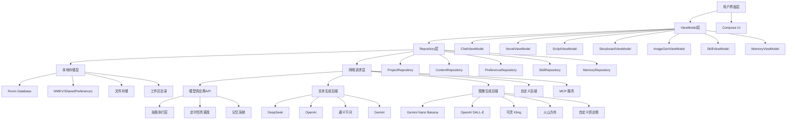
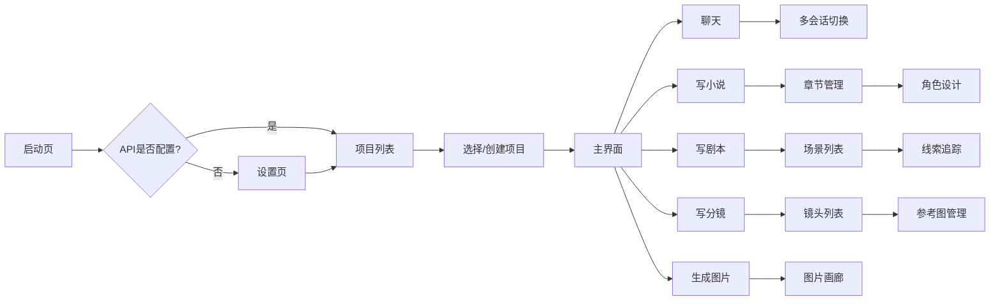

# Agent工作助手 - 技术设计文档

Feature Name: agent-work-assistant
Updated: 2026-08-03

## 描述

纯本地 Android 应用，通过对接第三方 AI 模型 API 实现智能创作功能。应用架构采用 MVVM 模式，前端使用 Kotlin + Jetpack Compose，后端通过 OkHttp 调用模型供应商 API。所有数据本地存储，无需自建后端服务。

**参考项目**:
- OmniBot (https://github.com/omnimind-ai/OpenOmniBot) - 端侧 AI Agent、技能体系、工作区管理、记忆系统、状态机驱动
- Zorv AI (https://github.com/Quor-a/ZorvAI) - ACI 跨应用调用、多模型对话、人格系统
- ArcReel (https://github.com/ArcReel/ArcReel) - 多供应商图像/视频生成、角色一致性、费用追踪

## 架构



### 架构说明

采用分层架构，职责清晰：

- **UI层**: 使用 Jetpack Compose 构建响应式界面
- **ViewModel层**: 管理UI状态和业务逻辑
- **Repository层**: 统一数据访问接口
- **存储层**: Room + MMKV/SharedPreferences + 文件系统 + 工作区目录
- **网络层**: 多供应商抽象层，支持文本和图像生成 API，MCP 服务
- **Agent 层**: 技能执行、定时任务、记忆系统（参考 OmniBot StateMachine 模式）

## 项目结构

```
com.agent.workassistant/
├── AgentApp.kt                          # Application 入口
├── MainActivity.kt                      # 主界面 Activity
├── di/                                  # 依赖注入模块
│   └── AppModule.kt
├── agent/                               # Agent 核心（参考 OmniBot assists 模块）
│   ├── StateMachine.kt                  # 任务状态机
│   ├── AgentCore.kt                     # Agent 核心接口
│   ├── SkillExecutor.kt                 # 技能执行器
│   ├── TaskScheduler.kt                 # 定时任务调度
│   └── MemoryManager.kt                 # 记忆管理器
├── ui/                                  # UI 层
│   ├── theme/                           # 主题配置
│   │   ├── Color.kt
│   │   ├── Theme.kt
│   │   └── Type.kt
│   ├── navigation/                      # 导航
│   │   └── AppNavigation.kt
│   ├── screens/                         # 屏幕页面
│   │   ├── chat/
│   │   │   ├── ChatScreen.kt
│   │   │   └── components/
│   │   │       ├── ChatMessageList.kt
│   │   │       ├── ChatInputBar.kt
│   │   │       └── ChatMessageItem.kt
│   │   ├── novel/
│   │   │   ├── NovelScreen.kt
│   │   │   └── components/
│   │   │       └── NovelEditor.kt
│   │   ├── script/
│   │   │   ├── ScriptScreen.kt
│   │   │   └── components/
│   │   │       └── ScriptEditor.kt
│   │   ├── storyboard/
│   │   │   ├── StoryboardScreen.kt
│   │   │   └── components/
│   │   │       └── StoryboardCard.kt
│   │   ├── imagegen/
│   │   │   ├── ImageGenScreen.kt
│   │   │   └── components/
│   │   │       └── ImageGallery.kt
│   │   ├── skills/
│   │   │   ├── SkillStoreScreen.kt
│   │   │   └── components/
│   │   │       └── SkillCard.kt
│   │   ├── workspace/
│   │   │   ├── WorkspaceScreen.kt
│   │   │   └── components/
│   │   │       ├── FileBrowser.kt
│   │   │       └── TerminalView.kt
│   │   └── settings/
│   │       ├── SettingsScreen.kt
│   │       └── components/
│   │           ├── ApiConfigPanel.kt
│   │           ├── ModelConfigPanel.kt
│   │           └── MemoryConfigPanel.kt
│   └── components/                      # 通用组件
│       ├── LoadingSpinner.kt
│       ├── ErrorView.kt
│       └── EmptyView.kt
├── repository/                          # Repository 层
│   ├── ProjectRepository.kt
│   ├── ContentRepository.kt
│   ├── ApiConfigRepository.kt
│   ├── SkillRepository.kt
│   └── MemoryRepository.kt
├── data/                                # 数据层
│   ├── database/
│   │   ├── AppDatabase.kt
│   │   ├── dao/
│   │   │   ├── ProjectDao.kt
│   │   │   ├── MessageDao.kt
│   │   │   ├── ChapterDao.kt
│   │   │   ├── SceneDao.kt
│   │   │   ├── ShotDao.kt
│   │   │   ├── ImageDao.kt
│   │   │   ├── SkillDao.kt
│   │   │   └── MemoryDao.kt
│   │   └── entity/
│   │       ├── Project.kt
│   │       ├── ChatMessage.kt
│   │       ├── NovelChapter.kt
│   │       ├── ScriptScene.kt
│   │       ├── StoryboardShot.kt
│   │       ├── GeneratedImage.kt
│   │       ├── Skill.kt
│   │       └── MemoryRecord.kt
│   └── network/
│       ├── ApiService.kt
│       ├── RetrofitClient.kt
│       ├── OkHttpUtil.kt
│       └── WebSocketClient.kt
├── model/                               # 数据模型
│   ├── ApiConfig.kt
│   ├── Provider.kt
│   ├── Skill.kt
│   └── Task.kt
├── utils/                               # 工具类
│   ├── EncryptionUtil.kt
│   ├── FileUtil.kt
│   └── DateUtil.kt
└── service/                             # 后台服务
    ├── AgentForegroundService.kt
    ├── TaskSchedulerService.kt
    └── McpServerService.kt
```
│   │   │   └── components/
│   │   │       └── ImagePreview.kt
│   │   ├── settings/
│   │   │   ├── SettingsScreen.kt
│   │   │   └── components/
│   │   │       └── ApiConfigPanel.kt
│   │   ├── projects/
│   │   │   ├── ProjectsScreen.kt
│   │   │   └── components/
│   │   │       └── ProjectCard.kt
│   │   └── main/
│   │       └── MainScreen.kt
│   └── components/                      # 通用组件
│       ├── TopAppBar.kt
│       ├── LoadingIndicator.kt
│       ├── ErrorView.kt
│       └── EmptyState.kt
├── viewmodel/                           # ViewModel 层
│   ├── ChatViewModel.kt
│   ├── NovelViewModel.kt
│   ├── ScriptViewModel.kt
│   ├── StoryboardViewModel.kt
│   ├── ImageGenViewModel.kt
│   ├── ProjectViewModel.kt
│   └── SettingsViewModel.kt
├── repository/                          # Repository 层
│   ├── ChatRepository.kt
│   ├── NovelRepository.kt
│   ├── ScriptRepository.kt
│   ├── StoryboardRepository.kt
│   ├── ImageGenRepository.kt
│   ├── ProjectRepository.kt
│   └── SettingsRepository.kt
├── data/                                # 数据层
│   ├── entity/                          # 数据实体
│   │   ├── ChatMessage.kt
│   │   ├── NovelChapter.kt
│   │   ├── ScriptScene.kt
│   │   ├── StoryboardShot.kt
│   │   ├── GeneratedImage.kt
│   │   └── Project.kt
│   ├── dao/                             # 数据访问对象
│   │   ├── ChatDao.kt
│   │   ├── NovelDao.kt
│   │   ├── ScriptDao.kt
│   │   ├── StoryboardDao.kt
│   │   ├── ImageDao.kt
│   │   └── ProjectDao.kt
│   ├── database/                        # 数据库
│   │   └── AgentDatabase.kt
│   ├── remote/                          # 网络层
│   │   ├── ApiClient.kt
│   │   ├── OpenAiApiService.kt
│   │   └── ImageGenerationApiService.kt
│   └── local/                           # 本地存储
│       └── SettingsPreferences.kt
├── model/                               # 模型层
│   ├── ChatRequest.kt
│   ├── ChatResponse.kt
│   ├── ImageGenerationRequest.kt
│   └── ImageGenerationResponse.kt
└── util/                                # 工具类
    ├── Constants.kt
    ├── NetworkUtils.kt
    ├── FileStorageUtils.kt
    └── EncodingUtils.kt
```

## 组件与接口

### 1. 多供应商抽象层 (ModelProvider)

**设计参考**: ArcReel 的 ImageBackend/VideoBackend/TextBackend 抽象协议

```kotlin
// 文本生成接口
interface TextBackend {
    suspend fun chat(messages: List<Message>, model: String): Flow<String>
    suspend fun chatComplete(messages: List<Message>, model: String): String
}

// 图像生成接口
interface ImageBackend {
    data class GenerationRequest(
        val prompt: String,
        val model: String,
        val size: String = "1024x1024",
        val style: String? = null,
        val seed: Long? = null
    )
    
    data class GenerationResult(
        val imageUrl: String,
        val prompt: String,
        val model: String,
        val seed: Long?
    )
    
    suspend fun generate(request: GenerationRequest): Flow<GenerationResult>
}
```

**供应商实现**:

```kotlin
// DeepSeek 文本生成
class DeepSeekTextBackend(private val apiKey: String) : TextBackend {
    override suspend fun chat(messages: List<Message>, model: String): Flow<String> {
        return flow {
            val response = client.post("/v1/chat/completions") {
                header("Authorization", "Bearer $apiKey")
                json = ChatRequest(messages = messages, model = model, stream = true)
            }
            // 流式解析 SSE
            response.body.byteStream().use { stream ->
                stream.bufferedReader().lineSequence()
                    .filter { it.startsWith("data: ") }
                    .map { it.removePrefix("data: ").trim() }
                    .forEach { emit(it) }
            }
        }
    }
}

// Gemini 图像生成
class GeminiImageBackend(private val apiKey: String) : ImageBackend {
    override suspend fun generate(request: GenerationRequest): Flow<GenerationResult> {
        return flow {
            val response = client.post("/v1beta/models/${request.model}:generateContent") {
                header("x-goog-api-key", apiKey)
                json = GeminiRequest(
                    contents = listOf(Content(parts = listOf(Part(text = request.prompt)))),
                    generationConfig = GenerationConfig(outputMimeType = "image/png")
                )
            }
            emit(GenerationResult(
                imageUrl = response.promptFeedback?.blockedReason?.toString() ?: "generated",
                prompt = request.prompt,
                model = request.model,
                seed = request.seed
            ))
        }
    }
}
```

### 2. 任务队列 (TaskQueue)

**设计参考**: ArcReel 的异步任务队列和 RPM 限速机制

```kotlin
class TaskQueue(
    private val imageRateLimit: Int = 10,      // 图像生成 RPM
    private val videoRateLimit: Int = 5,       // 视频生成 RPM
    private val textRateLimit: Int = 60        // 文本生成 RPM
) {
    private val imageChannel = Channel<Task>(capacity = CHANNEL_CAPACITY)
    private val videoChannel = Channel<Task>(capacity = CHANNEL_CAPACITY)
    private val textChannel = Channel<Task>(capacity = CHANNEL_CAPACITY)
    
    private val rateLimiter = RateLimiter(imageRateLimit, videoRateLimit, textRateLimit)
    
    suspend fun submitImageTask(task: ImageTask): Deferred<Result<ImageResult>>
    suspend fun submitVideoTask(task: VideoTask): Deferred<Result<VideoResult>>
    suspend fun submitTextTask(task: TextTask): Flow<TextResult>
    
    // 断点续传支持
    fun saveTaskState(taskId: String, state: TaskState)
    fun restoreTaskState(taskId: String): TaskState?
}
```

**任务状态管理**:

```kotlin
data class TaskState(
    val taskId: String,
    val status: TaskStatus,  // PENDING/PROCESSING/COMPLETED/FAILED
    val progress: Float,
    val retryCount: Int,
    val lastError: String?
)

enum class TaskStatus {
    PENDING, PROCESSING, COMPLETED, FAILED, CANCELLED
}
```

### 3. API 客户端 (ApiClient)

**职责**: 封装 HTTP 请求，处理认证、超时和错误

```kotlin
class ApiClient private constructor() {
    companion object {
        val instance: ApiClient by lazy { ApiClient() }
    }
    
    private val httpClient = OkHttpClient.Builder()
        .connectTimeout(30, TimeUnit.SECONDS)
        .readTimeout(300, TimeUnit.SECONDS)  // 长任务超时
        .writeTimeout(30, TimeUnit.SECONDS)
        .addInterceptor(AuthInterceptor())
        .addInterceptor(LoggingInterceptor())
        .addInterceptor(RateLimitInterceptor())
        .build()
    
    // 供应商注册表
    private val textBackends = mutableMapOf<String, TextBackend>()
    private val imageBackends = mutableMapOf<String, ImageBackend>()
    
    fun registerTextBackend(provider: String, backend: TextBackend)
    fun registerImageBackend(provider: String, backend: ImageBackend)
    
    fun getTextBackend(provider: String): TextBackend?
    fun getImageBackend(provider: String): ImageBackend?
}
```

**支持的模型供应商**:

| 供应商 | 类型 | API 端点 | 认证方式 |
|--------|------|----------|----------|
| DeepSeek | 文本 | https://api.deepseek.com/v1 | Bearer Token |
| OpenAI | 文本/图像 | https://api.openai.com/v1 | Bearer Token |
| 通义千问 | 文本 | https://dashscope.aliyuncs.com/compatible-mode/v1 | Bearer Token |
| Gemini | 文本/图像 | https://generativelanguage.googleapis.com/v1beta | API Key |
| 可灵 Kling | 图像/视频 | https://api.klingai.com | Bearer Token |
| 火山方舟 | 文本/图像/视频 | https://ark.cn-beijing.volces.com/api | Bearer Token |
| 自定义 | 文本/图像 | 用户配置 | Bearer Token |

### 4. ChatViewModel

**设计参考**: Zorv AI 的多会话隔离和种子快照机制

```kotlin
class ChatViewModel(
    private val chatRepository: ChatRepository,
    private val apiClient: ApiClient
) : ViewModel() {
    // 多会话隔离
    private val sessionStates = MutableStateFlow<Map<String, SessionState>>(emptyMap())
    
    data class SessionState(
        val messages: List<ChatMessage>,
        val contextLength: Int,
        val lastUpdate: Long
    )
    
    val messages: StateFlow<List<ChatMessage>> = ...
    val isLoading: StateFlow<Boolean> = ...
    val errorMessage: StateFlow<String?> = ...
    
    fun sendMessage(content: String, sessionId: String) {
        viewModelScope.launch {
            isLoading.value = true
            try {
                // 流式响应处理
                apiClient.getTextBackend(selectedProvider)
                    ?.chat(buildMessages(sessionId), model)
                    ?.collect { chunk ->
                        appendChunk(sessionId, chunk)
                    }
            } catch (e: Exception) {
                errorMessage.value = e.message
            } finally {
                isLoading.value = false
            }
        }
    }
    
    // 上下文管理 - 自动裁剪过长历史
    private fun buildMessages(sessionId: String): List<Message> {
        val history = chatRepository.getMessages(sessionId)
        return if (history.size > MAX_CONTEXT_MESSAGES) {
            history.takeLast(MAX_CONTEXT_MESSAGES)
        } else {
            history
        }
    }
}
```

### 5. 角色一致性管理 (CharacterConsistency)

**设计参考**: ArcReel 的角色设计图和线索追踪机制

```kotlin
class CharacterConsistencyManager {
    // 角色资产存储
    private val characterAssets = MutableLiveData<Map<String, CharacterAsset>>()
    
    data class CharacterAsset(
        val characterId: String,
        val name: String,
        val description: String,
        val designImageUrls: List<String>,  // 角色设计图
        val appearanceNotes: String,  // 外观描述用于一致性生成
        val voiceSettings: VoiceSettings?  // 语音设置
    )
    
    // 线索追踪
    data class ClueAsset(
        val clueId: String,
        val name: String,
        val description: String,
        val referenceImage: String?,
        val appearanceInScenes: List<Int>
    )
    
    fun generateConsistentCharacter(
        name: String,
        description: String,
        style: String
    ): Deferred<CharacterAsset>
    
    fun updateCharacterAppearance(characterId: String, notes: String)
    fun getCharacterPrompt(characterId: String): String
}
```

**角色一致性生成流程**:

```
用户输入角色描述
       ↓
AI 生成角色设计图（参考图）
       ↓
存储角色外观特征
       ↓
后续生成时注入角色参考图
       ↓
确保跨镜头角色一致性
```

### 6. 版本历史管理 (VersionHistory)

**设计参考**: ArcReel 的版本回滚机制

```kotlin
class VersionHistoryManager {
    data class Version(
        val versionId: String,
        val contentId: String,
        val content: String,
        val createdAt: Long,
        val notes: String?,
        val parentVersionId: String?
    )
    
    private val versions = MutableLiveData<List<Version>>(emptyList())
    
    suspend fun createVersion(contentId: String, notes: String? = null): String
    suspend fun getVersion(versionId: String): Version?
    suspend fun rollbackToVersion(contentId: String, versionId: String): Boolean
    suspend fun deleteVersion(versionId: String): Boolean
    suspend fun getVersions(contentId: String): List<Version>
    
    // 自动保存版本（每 N 次编辑）
    fun enableAutoSave(interval: Int)
}
```

### 7. 费用追踪 (CostTracking)

**设计参考**: ArcReel 的多供应商费用追踪

```kotlin
class CostTracker {
    data class UsageRecord(
        val provider: String,
        val model: String,
        val inputTokens: Int,
        val outputTokens: Int,
        val imagesGenerated: Int,
        val timestamp: Long,
        val costUsd: Double
    )
    
    data class ProjectCost(
        val projectId: String,
        val totalCostUsd: Double,
        val breakdown: Map<String, Double>  // 按供应商
    )
    
    private val usageRecords = MutableLiveData<List<UsageRecord>>(emptyList())
    
    fun recordUsage(record: UsageRecord)
    fun getProjectCost(projectId: String): ProjectCost
    fun estimateCost(prompt: String, model: String, tokens: Int): Double
    fun getMonthlySpending(): Map<String, Double>
}
```

**计费策略**:

| 供应商 | 文本计费 | 图像计费 |
|--------|----------|----------|
| DeepSeek | 输入 1元/百万token, 输出 2元/百万token | - |
| OpenAI | 按模型不同，约 0.01-0.03美元/千token | DALL-E 3: 0.04-0.12美元/张 |
| Gemini | 输入 0.00025美元/千token | Nano Banana: 按分辨率查表 |
| 可灵 | - | 按积分折算 |

### 8. 流式响应处理 (StreamResponse)

**设计参考**: Zorv AI 的流式对话体验

```kotlin
class StreamResponseHandler {
    fun handleStream(
        flow: Flow<String>,
        onChunk: (String) -> Unit,
        onComplete: (String) -> Unit,
        onError: (Exception) -> Unit
    ): Job {
        return viewModelScope.launch {
            var accumulated = ""
            try {
                flow.collect { chunk ->
                    accumulated += chunk
                    onChunk(accumulated)  // 实时更新 UI
                }
                onComplete(accumulated)
            } catch (e: Exception) {
                onError(e)
            }
        }
    }
}

// 使用示例
class ChatViewModel(...) {
    fun sendMessage(content: String) {
        val flow = apiClient.getTextBackend(provider)
            ?.chat(messages, model) ?: return
        
        streamHandler.handleStream(
            flow = flow,
            onChunk = { text -> updateStreamingText(text) },
            onComplete = { text -> saveMessage(text) },
            onError = { error -> showError(error) }
        )
    }
}
```

## 数据模型

### 项目 (Project)

```kotlin
@Entity(tableName = "projects")
data class Project(
    @PrimaryKey val id: String = UUID.randomUUID().toString(),
    val name: String,
    val description: String,
    val createdAt: Long,
    val updatedAt: Long,
    val type: ProjectType,  // NOVEL/SCRIPT/STORYBOARD/MIXED
    val characterAssets: String? = null,  // JSON: 角色资产列表
    val clueAssets: String? = null,       // JSON: 线索资产列表
    val styleReference: String? = null,   // JSON: 风格参考图
    val totalCost: Double = 0.0,          // 项目总费用
    val versionCount: Int = 0             // 版本数量
)

enum class ProjectType {
    NOVEL, SCRIPT, STORYBOARD, MIXED
}
```

### 聊天消息 (ChatMessage)

```kotlin
@Entity(
    tableName = "chat_messages",
    indices = [Index(value = ["project_id"])],
    foreignKeys = [ForeignKey(
        entity = Project::class,
        parentColumns = ["id"],
        childColumns = ["project_id"],
        onDelete = ForeignKey.CASCADE
    )]
)
data class ChatMessage(
    @PrimaryKey val id: String = UUID.randomUUID().toString(),
    val projectId: String,
    val role: MessageRole,  // USER/ASSISTANT/SYSTEM
    val content: String,
    val timestamp: Long,
    val metadata: String? = null,  // JSON: {"provider":"deepseek","model":"v3","tokens":1234}
    val costUsd: Double = 0.0
)

enum class MessageRole {
    USER, ASSISTANT, SYSTEM
}
```

### 小说章节 (NovelChapter)

```kotlin
@Entity(
    tableName = "novel_chapters",
    foreignKeys = [ForeignKey(
        entity = Project::class,
        parentColumns = ["id"],
        childColumns = ["project_id"],
        onDelete = ForeignKey.CASCADE
    )]
)
data class NovelChapter(
    @PrimaryKey val id: String = UUID.randomUUID().toString(),
    val projectId: String,
    val title: String,
    val content: String,
    val order: Int,
    val createdAt: Long,
    val updatedAt: Long,
    val versionCount: Int = 1,
    val lastModifiedBy: String? = null  // 最后修改的 AI 模型
)
```

### 剧本场景 (ScriptScene)

```kotlin
@Entity(
    tableName = "script_scenes",
    foreignKeys = [ForeignKey(
        entity = Project::class,
        parentColumns = ["id"],
        childColumns = ["project_id"],
        onDelete = ForeignKey.CASCADE
    )]
)
data class ScriptScene(
    @PrimaryKey val id: String = UUID.randomUUID().toString(),
    val projectId: String,
    val sceneNumber: Int,
    val location: String,  // 场景地点
    val timeOfDay: String,  // 时间（日/夜）
    val action: String,  // 动作描述
    val dialogues: String,  // 角色对话（JSON 数组）
    val notes: String? = null,
    val createdAt: Long,
    val versionId: String? = null
)
```

### 分镜镜头 (StoryboardShot)

```kotlin
@Entity(
    tableName = "storyboard_shots",
    foreignKeys = [ForeignKey(
        entity = Project::class,
        parentColumns = ["id"],
        childColumns = ["project_id"],
        onDelete = ForeignKey.CASCADE
    )],
    indices = [Index(value = ["scene_id"])]
)
data class StoryboardShot(
    @PrimaryKey val id: String = UUID.randomUUID().toString(),
    val projectId: String,
    val sceneId: String,
    val shotNumber: Int,
    val shotType: ShotType,  // 远景/中景/近景/特写
    val description: String,
    val cameraMovement: String? = null,
    val duration: String? = null,
    val dialogue: String? = null,
    val imageUrl: String? = null,
    val characterRefs: String? = null,  // JSON: 关联的角色 ID 列表
    val clueRefs: String? = null,       // JSON: 关联的线索 ID 列表
    val createdAt: Long
)

enum class ShotType(val value: String) {
    EXTREME_LONG_SHOT(" extreme_long_shot"),   // 极远景
    LONG_SHOT("long_shot"),                   // 远景
    MEDIUM_SHOT("medium_shot"),                // 中景
    CLOSE_UP("close_up"),                      // 近景
    EXTREME_CLOSE_UP("extreme_close_up")       // 特写
}
```

### 生成图片 (GeneratedImage)

```kotlin
@Entity(
    tableName = "generated_images",
    foreignKeys = [ForeignKey(
        entity = Project::class,
        parentColumns = ["id"],
        childColumns = ["project_id"],
        onDelete = ForeignKey.CASCADE
    )],
    indices = [Index(value = ["shot_id"])]
)
data class GeneratedImage(
    @PrimaryKey val id: String = UUID.randomUUID().toString(),
    val projectId: String,
    val prompt: String,
    val negativePrompt: String? = null,
    val style: String? = null,
    val size: String,
    val model: String,
    val provider: String,
    val localPath: String,
    val thumbnailPath: String? = null,
    val seed: Long? = null,
    val createdAt: Long,
    val costUsd: Double = 0.0,
    val shotId: String? = null  // 关联的分镜
)
```

### 角色资产 (CharacterAsset)

```kotlin
@Entity(tableName = "character_assets")
data class CharacterAsset(
    @PrimaryKey val id: String = UUID.randomUUID().toString(),
    val projectId: String,
    val name: String,
    val description: String,
    val designImageUrls: String,  // JSON 数组
    val appearanceNotes: String,
    val createdAt: Long
)
```

### 线索资产 (ClueAsset)

```kotlin
@Entity(tableName = "clue_assets")
data class ClueAsset(
    @PrimaryKey val id: String = UUID.randomUUID().toString(),
    val projectId: String,
    val name: String,
    val description: String,
    val referenceImageUrl: String? = null,
    val appearanceInScenes: String,  // JSON 数组
    val createdAt: Long
)
```

### 版本记录 (VersionRecord)

```kotlin
@Entity(
    tableName = "version_records",
    indices = [Index(value = ["content_id"])]
)
data class VersionRecord(
    @PrimaryKey val id: String = UUID.randomUUID().toString(),
    val contentType: String,  // NOVEL/SCRIPT/STORYBOARD
    val contentId: String,
    val content: String,
    val notes: String? = null,
    val createdAt: Long,
    val parentVersionId: String? = null
)
```

## 正确性属性

### 不变量

1. 每个项目 SHALL 至少有一个创建时间戳
2. 每个聊天消息 SHALL 关联到有效的项目 ID
3. API Key SHALL 加密存储，不得明文保存
4. 生成的图片 SHALL 保留原始请求参数以便重现
5. 角色资产 SHALL 在项目删除时级联删除
6. 费用记录 SHALL 与消息/图片一一对应

### 约束

1. 消息角色 SHALL 只能是 USER/ASSISTANT/SYSTEM 之一
2. 分镜镜头类型 SHALL 从预定义枚举中选取
3. 图片尺寸 SHALL 符合标准比例（1:1/16:9/9:16/4:3）
4. 角色名称在项目内 SHALL 唯一
5. 版本记录 SHALL 保持链式结构（parentVersionId 引用）

## 错误处理

### API 错误处理

```kotlin
sealed class ApiResult<out T> {
    data class Success<T>(val data: T) : ApiResult<T>()
    data class Error(val message: String, val code: Int? = null, val retryable: Boolean = true) : ApiResult<Nothing>()
    object Loading : ApiResult<Nothing>()
}

// 供应商特定错误
sealed class ProviderError : Throwable() {
    object RateLimited : ProviderError()           // 429 限流
    object InvalidApiKey : ProviderError()         // 401 认证失败
    object ModelNotFound : ProviderError()         // 模型不可用
    object ContentFiltered : ProviderError()       // 内容过滤
    object ServerError(val code: Int) : ProviderError()  // 5xx 服务器错误
}
```

**错误码映射**:

| HTTP 码 | 处理策略 | 重试机制 |
|---------|----------|----------|
| 401 | 提示用户重新配置 API Key | 不重试 |
| 403 | 提示用户检查权限 | 不重试 |
| 429 | 显示限流提示，等待后重试 | 指数退避（1s, 2s, 4s） |
| 500 | 显示服务器错误提示 | 重试 3 次 |
| 503 | 显示服务不可用提示 | 重试 3 次 |
| 超时 | 提示网络超时，允许重试 | 用户手动重试 |

### 本地存储错误

- 使用 try-catch 包裹所有数据库操作
- 存储失败时显示 Toast 提示
- 自动重试机制（最多 3 次）
- 失败时记录诊断日志到 Download 目录

### 网络错误

- 使用 OkHttp 拦截器记录网络日志
- 网络不可用时显示离线提示
- 自动重连机制
- 支持断点续传（大文件下载）

## 测试策略

### 单元测试

1. **ViewModel 测试**: 使用 coroutine test 验证状态流转
2. **Repository 测试**: Mock 网络响应验证数据映射
3. **工具类测试**: 验证编码/解码、路径处理等

### 集成测试

1. **数据库测试**: 使用 InMemoryFallbackCache 验证 CRUD 操作
2. **API 测试**: 使用 MockWebServer 验证网络请求

### UI 测试

1. **Compose 测试**: 验证界面渲染和交互
2. **导航测试**: 验证页面跳转逻辑

## 关键技术决策

### 1. 架构选择: MVVM + 组合模式

- ViewModel 持有状态，Composable 函数响应状态变化
- 通过组合模式复用 UI 组件
- 遵循单一职责原则

### 2. 异步处理: Kotlin Coroutines + Flow

- 使用 suspend 函数处理异步请求
- 使用 StateFlow 管理 UI 状态
- 使用 Channel 处理事件流
- **参考 Zorv AI**: 使用 liveBuffers 实现多会话隔离

### 3. 依赖注入: Hilt

- 使用 Hilt 管理依赖生命周期
- 提供 Application 级别的作用域
- 支持测试时注入 Mock 对象

### 4. 本地存储: Room Database

- 提供类型安全的数据库访问
- 支持 DAO 操作和 LiveData/Flow 集成
- 自动处理数据库迁移

### 5. 网络请求: OkHttp + Retrofit

- Retrofit 提供类型安全的 API 接口定义
- OkHttp 提供拦截器支持（日志、认证等）
- 支持请求超时和重试配置

### 6. 多供应商架构（参考 ArcReel）

- 定义抽象接口 TextBackend 和 ImageBackend
- 每个供应商实现对应接口
- 支持运行时切换供应商
- 统一的错误处理和费用追踪

### 7. 流式响应处理（参考 Zorv AI）

- 使用 Kotlin Flow 处理流式响应
- 实时更新 UI，提供即时反馈
- 支持取消操作和错误恢复

### 8. 角色一致性（参考 ArcReel）

- 先生成角色设计图作为参考
- 后续生成时注入角色参考图
- 确保跨镜头角色外观一致

### 9. 版本管理（参考 ArcReel）

- 每次重要编辑自动保存版本
- 支持版本回滚和对比
- 记录版本变更说明

### 10. 费用追踪（参考 ArcReel）

- 每次 API 调用记录 Token 用量
- 按供应商和项目统计费用
- 提供费用预估功能

### 11. Agent 状态机（参考 OmniBot）

**设计参考**: OmniBot 的 StateMachine 和 AssistsCore

```kotlin
// 任务状态机 - 参考 OmniBot StateMachine.kt
class AgentStateMachine(private val scope: CoroutineScope) {
    enum class TaskState {
        IDLE, COMPREHENDING, DECIDING, EXECUTING, REFLECTING, COMPLETED, FAILED, CANCELLED
    }
    
    private val currentState = MutableStateFlow(TaskState.IDLE)
    private val taskQueue = Channel<Task>(capacity = 10)
    
    // 任务生命周期管理
    suspend fun startTask(task: Task)
    suspend fun pauseTask(taskId: String)
    suspend fun resumeTask(taskId: String)
    suspend fun cancelTask(taskId: String)
    
    // 状态转换
    fun transitionTo(state: TaskState)
    val currentState: StateFlow<TaskState> get() = currentState
    
    // 子 Agent 支持
    fun spawnSubAgent(parentTask: Task, subTask: Task): Job
}

// 任务核心接口 - 参考 OmniBot AssistsCore.kt
interface AgentCore {
    // 创建任务
    suspend fun createTask(params: TaskParams): Task
    
    // 任务执行
    suspend fun executeTask(task: Task): TaskResult
    
    // 任务回调
    fun onTaskUpdate(taskId: String, update: TaskUpdate)
    fun onTaskComplete(taskId: String, result: TaskResult)
    fun onTaskError(taskId: String, error: AgentError)
}

data class TaskParams(
    val type: TaskType,      // CHAT/NOVEL/SCRIPT/STORYBOARD/IMAGE/SCHEDULED
    val content: String,
    val model: String,
    val provider: String,
    val metadata: Map<String, String> = emptyMap()
)

data class TaskResult(
    val taskId: String,
    val success: Boolean,
    val output: String?,
    val error: String?,
    val tokensUsed: Int,
    val costUsd: Double
)
```

### 12. 技能系统（参考 OmniBot Skills）

**设计参考**: OmniBot 的技能商店和安装机制

```kotlin
// 技能接口
interface Skill {
    val id: String
    val name: String
    val description: String
    val version: String
    val enabled: Boolean
    
    suspend fun execute(params: Map<String, String>): String
    suspend fun validate(params: Map<String, String>): Boolean
}

// 技能管理器 - 参考 OmniBot skills/ 目录
class SkillManager {
    private val skills = MutableLiveData<Map<String, Skill>>(emptyMap())
    
    // 技能安装 - 从 GitHub 仓库链接安装
    suspend fun installSkill(repoUrl: String): Result<Skill>
    
    // 技能启用/禁用
    fun enableSkill(skillId: String)
    fun disableSkill(skillId: String)
    
    // 技能列表
    fun getAvailableSkills(): Flow<List<Skill>>
    fun searchSkills(query: String): Flow<List<Skill>>
    
    // 推荐技能仓库
    companion object {
        val RECOMMENDED_SKILLS = listOf(
            "https://github.com/OpenMinis/MinisSkills"
        )
    }
}

// 内置技能示例
class FileReadSkill : Skill {
    override val id = "file_read"
    override val name = "文件读取"
    override val description = "读取指定路径的文件内容"
    
    override suspend fun execute(params: Map<String, String>): String {
        val path = params["path"] ?: return "缺少路径参数"
        return File(path).readText()
    }
}

class CodeSearchSkill : Skill {
    override val id = "code_search"
    override val name = "代码搜索"
    override val description = "在项目中搜索代码"
    
    override suspend fun execute(params: Map<String, String>): String {
        val query = params["query"] ?: return "缺少搜索关键词"
        // 实现代码搜索逻辑
        return searchCode(query)
    }
}
```

### 13. 记忆系统（参考 OmniBot Memory）

**设计参考**: OmniBot 的 SOUL.md/CHAT.md/MEMORY.md 三层记忆

```kotlin
// 记忆管理器 - 参考 OmniBot AgentWorkspaceManager
class MemoryManager(private val workspaceDir: File) {
    // 三层记忆文件
    private val soulFile = File(workspaceDir, "memory/SOUL.md")
    private val chatFile = File(workspaceDir, "memory/CHAT.md")
    private val memoryFile = File(workspaceDir, "memory/MEMORY.md")
    private val shortMemoriesDir = File(workspaceDir, "memory/short-memories/")
    
    // 角色记忆 - 定义 AI 的角色和行为边界
    var soul: String
        get() = soulFile.readText()
        set(value) = soulFile.writeText(value)
    
    // 对话提示 - 每次对话的默认上下文
    var chatPrompt: String
        get() = chatFile.readText()
        set(value) = chatFile.writeText(value)
    
    // 长期记忆 - 跨会话的持久记忆
    var longTermMemory: String
        get() = memoryFile.readText()
        set(value) = memoryFile.writeText(value)
    
    // 短期记忆 - 当前会话的临时记忆
    fun getShortMemories(): List<File>
    fun addShortMemory(content: String)
    
    // 记忆嵌入 - 用于语义搜索
    fun configureEmbedding(model: String, apiKey: String)
    fun embedMemory(text: String): Deferred<List<Float>>
    
    // 夜间整理 - 将短期记忆合并到长期记忆
    fun performNightlyRollup()
    
    // 记忆搜索 - 基于 embedding 的语义搜索
    fun searchMemories(query: String, topK: Int = 5): List<MemoryRecord>
}

data class MemoryRecord(
    val id: String,
    val content: String,
    val embedding: List<Float>,
    val createdAt: Long,
    val type: MemoryType  // SHORT/LONG/CHARACTER
)

enum class MemoryType {
    SHORT, LONG, CHARACTER
}
```

**记忆文件结构**:

```
workspace/.omnibot/
├── agent/config.json      # Agent 配置
├── memory/
│   ├── SOUL.md            # 角色记忆
│   ├── CHAT.md            # 对话提示
│   ├── MEMORY.md          # 长期记忆
│   └── short-memories/    # 短期记忆目录
├── models/                # 本地模型
├── skills/               # 技能目录
├── attachments/          # 附件目录
└── browser/              # 浏览器数据
```

### 14. 工作区管理（参考 OmniBot Workspace）

**设计参考**: OmniBot 的工作区文件系统

```kotlin
// 工作区管理器
class WorkspaceManager(private val context: Context) {
    // 工作区根目录
    val workspaceDir: File get() = File(context.filesDir, "workspace/.agent_work/")
    
    // 项目目录
    fun getProjectDir(projectId: String): File
        = File(workspaceDir, "projects/$projectId")
    
    // 文件操作
    fun createFile(projectId: String, path: String): File
    fun readFile(projectId: String, path: String): String
    fun writeFile(projectId: String, path: String, content: String)
    fun deleteFile(projectId: String, path: String): Boolean
    fun listFiles(projectId: String, path: String): List<File>
    
    // 文件预览
    fun getPreview(type: String, path: String): Any?
    
    // Artifact 管理
    fun saveArtifact(projectId: String, artifact: Artifact): String
    fun getArtifact(artifactId: String): Artifact?
    
    data class Artifact(
        val id: String,
        val type: String,  // NOVEL/SCRIPT/STORYBOARD/IMAGE
        val content: String,
        val path: String,
        val createdAt: Long
    )
}
```

### 15. 定时任务调度（参考 OmniBot Scheduled Tasks）

**设计参考**: OmniBot 的定时任务系统

```kotlin
// 定时任务管理器
class TaskScheduler(private val context: Context) {
    private val alarmManager = context.getSystemService(Context.ALARM_SERVICE) as AlarmManager
    private val sharedPreferences = context.getSharedPreferences("scheduled_tasks", Context.MODE_PRIVATE)
    
    // 任务类型
    data class ScheduledTask(
        val id: String,
        val type: TaskType,      // SUBAGENT/ALARM/PERIODIC
        val title: String,
        val content: String,
        val executeAt: Long,      // 执行时间戳
        val interval: Long? = null,  // 周期（毫秒）
        val enabled: Boolean = true,
        val metadata: Map<String, String> = emptyMap()
    )
    
    // 创建定时任务
    suspend fun createTask(task: ScheduledTask): String
    
    // 取消任务
    fun cancelTask(taskId: String)
    
    // 执行子 Agent 任务
    fun executeSubAgent(task: ScheduledTask)
    
    // 闹钟提醒
    fun setAlarm(title: String, message: String, atMillis: Long)
    
    // 任务恢复 - 应用启动时恢复未完成的定时任务
    fun restorePendingTasks()
}

// 前台服务 - 保持 Agent 持续运行
@Service
class AgentForegroundService : Service() {
    override fun onCreate() {
        super.onCreate()
        // 启动 Agent 服务
        AgentStateMachine.getInstance(this).start()
    }
    
    override fun onStartCommand(intent: Intent?, flags: Int, startId: Int): Int {
        return START_STICKY
    }
    
    override fun onBind(intent: Intent?): IBinder? = null
}
```

## 界面流程



## 开发计划

### Phase 1: 基础架构搭建 (1-2 周)

- [ ] 项目初始化（Gradle 配置、依赖引入）
- [ ] 创建数据模型和数据库
- [ ] 实现多供应商抽象层（TextBackend/ImageBackend）
- [ ] 实现 DeepSeek/OpenAI 文本生成接口
- [ ] 实现 Gemini/DALL-E 图像生成接口
- [ ] 搭建基础 UI 框架（主题、导航、布局）
- [ ] 实现 Agent 状态机（参考 OmniBot StateMachine）
- [ ] 实现工作区管理器（参考 OmniBot WorkspaceManager）

### Phase 2: 核心功能开发 (2-3 周)

- [ ] 实现聊天功能（流式响应、多会话）
- [ ] 实现小说创作功能（章节管理、自动保存）
- [ ] 实现剧本创作功能（场景管理、格式导出）
- [ ] 实现分镜设计功能（镜头管理、角色关联）
- [ ] 实现角色一致性管理
- [ ] 实现版本历史记录
- [ ] 实现记忆系统（SOUL/CHAT/MEMORY）
- [ ] 实现技能系统基础框架

### Phase 3: 高级功能与优化 (1-2 周)

- [ ] 实现图片生成功能（多供应商、风格选择）
- [ ] 实现费用追踪功能
- [ ] 实现任务队列（RPM 限速、并发控制）
- [ ] 实现技能商店（安装/启用/禁用）
- [ ] 实现定时任务调度
- [ ] 实现 MCP 局域网服务
- [ ] 实现内容导入导出（Markdown/PDF）
- [ ] 性能优化（图片懒加载、数据库索引）
- [ ] 错误处理完善（重试机制、离线支持）
- [ ] 实现终端运行时（参考 OmniBot ReTerminal）

### Phase 4: 测试与发布 (1 周)

- [ ] 单元测试编写（ViewModel、Repository、Agent）
- [ ] UI 测试编写（Compose Testing）
- [ ] 集成测试（数据库、API mock）
- [ ] 性能测试（内存、启动时间）
- [ ] 打包发布（Debug/Release APK）

## 依赖清单

```kotlin
// Core
implementation("androidx.core:core-ktx:1.12.0")
implementation("androidx.appcompat:appcompat:1.6.1")
implementation("com.google.android.material:material:1.11.0")

// Compose
implementation(platform("androidx.compose:compose-bom:2024.01.00"))
implementation("androidx.compose.ui:ui")
implementation("androidx.compose.material3:material3")
implementation("androidx.compose.ui:ui-tooling-preview")
debugImplementation("androidx.compose.ui:ui-tooling")
implementation("androidx.compose.foundation:foundation")
implementation("androidx.compose.runtime:runtime-livedata")

// Navigation
implementation("androidx.navigation:navigation-compose:2.7.6")

// Lifecycle
implementation("androidx.lifecycle:lifecycle-viewmodel-compose:2.7.0")
implementation("androidx.lifecycle:lifecycle-runtime-compose:2.7.0")
implementation("androidx.lifecycle:lifecycle-viewmodel-ktx:2.7.0")

// Coroutines
implementation("org.jetbrains.kotlinx:kotlinx-coroutines-android:1.7.3")
implementation("org.jetbrains.kotlinx:kotlinx-coroutines-play-services:1.7.3")

// Room
implementation("androidx.room:room-runtime:2.6.1")
kapt("androidx.room:room-compiler:2.6.1")
implementation("androidx.room:room-ktx:2.6.1")
implementation("androidx.room:room-paging:2.6.1")

// Hilt
implementation("com.google.dagger:hilt-android:2.50")
kapt("com.google.dagger:hilt-compiler:2.50")
implementation("androidx.hilt:hilt-navigation-compose:1.1.0")

// Retrofit
implementation("com.squareup.retrofit2:retrofit:2.9.0")
implementation("com.squareup.retrofit2:converter-gson:2.9.0")
implementation("com.squareup.retrofit2:converter-moshi:2.9.0")

// OkHttp
implementation("com.squareup.okhttp3:okhttp:4.12.0")
implementation("com.squareup.okhttp3:logging-interceptor:4.12.0")

// Coil (图片加载)
implementation("io.coil-kt:coil-compose:2.5.0")
implementation("io.coil-kt:coil-gif:2.5.0")  // 支持 GIF

// DataStore
implementation("androidx.datastore:datastore-preferences:1.0.0")

// Serialization
implementation("org.jetbrains.kotlinx:kotlinx-serialization-json:1.6.2")

// Markdown 渲染
implementation("org.commonmark:commonmark:0.21.0")
implementation("org.commonmark:commonmark-ext-gfm-tables:0.21.0")

// 加密存储
implementation("androidx.security:security-crypto:1.1.0-alpha06")

// 权限处理
implementation("com.google.accompanist:accompanist-permissions:0.34.0")

// 图表（费用统计）
implementation("com.github.PhilJay:MPAndroidChart:v3.1.0")

// Embedding（记忆搜索）
implementation("com.google.ai.client.generativeai:generativeai:0.9.0")

// MMKV（轻量存储，参考 OmniBot）
implementation("com.tencent:mmkv:1.3.9")

// 终端运行时（参考 OmniBot ReTerminal）
implementation("io.github.g007:terminal-view:1.0.0")
```

## 参考项目

### 1. OmniBot
- **地址**: https://github.com/omnimind-ai/OpenOmniBot
- **文档**: https://omnimind-ai.github.io/OmniBot-Docs/
- **技术栈**: Kotlin + Flutter 混合架构
- **参考点**: 
  - 端侧 AI Agent 架构
  - 技能体系（Skills）
  - 工作区管理（Workspace）
  - 三层记忆系统（SOUL/CHAT/MEMORY）
  - 状态机驱动的任务管理
  - MCP 服务（局域网 API）
  - 定时任务与子 Agent
  - 场景模型绑定（dispatch/vlm/compactor/embedding）
  - 本地模型支持（llama.cpp/MNN/QNN）

### 2. Zorv AI
- **地址**: https://github.com/Quor-a/ZorvAI
- **技术栈**: Kotlin + Jetpack Compose
- **参考点**: 
  - ACI 跨应用调用框架
  - 多模型对话管理
  - 人格系统和记忆机制
  - 流式响应处理
  - 多会话隔离

### 3. ArcReel
- **地址**: https://github.com/ArcReel/ArcReel
- **技术栈**: Python (FastAPI) + React 19
- **参考点**:
  - 多供应商抽象层（ImageBackend/VideoBackend/TextBackend）
  - 角色一致性管理
  - 线索追踪机制
  - 版本历史记录
  - 费用追踪系统
  - 异步任务队列

## API 参考

- [Android 官方文档](https://developer.android.com)
- [Jetpack Compose 文档](https://developer.android.com/jetpack/compose)
- [DeepSeek API 文档](https://platform.deepseek.com/api-docs/)
- [OpenAI API 文档](https://platform.openai.com/docs/api-reference)
- [Gemini API 文档](https://ai.google.dev/gemini-api/docs)
- [可灵 API 文档](https://klingai.com/docs/api)
